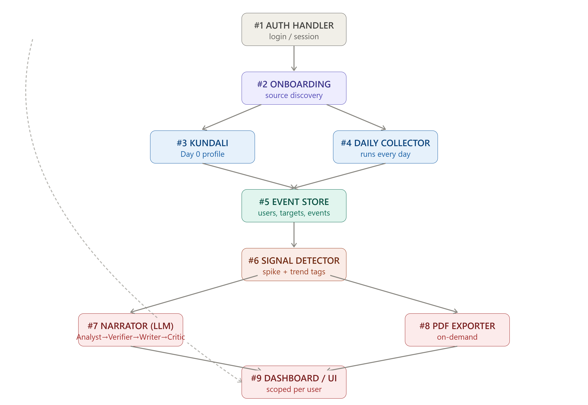

# RAVN — Component Specification

## 1. Auth Handler

- **Trigger:** Sign-up, login, or session validation on each request
- **Input:** User credentials or session token
- **Output:** Hashed/verified passwords, issued session tokens (JWT), validated tokens on protected routes, identified requesting user → scopes every downstream action to that user
- **Feeds:** User identity → Onboarding Handler and Dashboard/UI

---

## 2. Onboarding Handler

- **Trigger:** User submits a company website URL
- **Input:** Company website URL
- **Output:** Confirmed set of source URLs (GitHub org, ATS board, blog, web/social) → handed to Kundali builder; also saved as the target's known sources
- **Feeds:** Confirmed sources → Kundali Builder (background trigger) and Event Store (target registry entry)

---

## 3. Kundali Builder

- **Trigger:** Immediately after onboarding confirmation; runs async, target shows "building..." in dashboard meanwhile
- **Input:** Confirmed source URLs for that target
- **Output:** The Day 0 profile — max available historical context, tech stack, cadence baseline, recent shifts → stored, and used as reference context for later stages
- **Feeds:** Finished Kundali profile → Event Store; flips target status to "ready"

---

## 4. Daily Collector

- **Trigger:** Scheduled, runs once per day per active target, independent per source type (isolated failure handling)
- **Input:** Target's confirmed source URLs + last-checked timestamp (so it only pulls new activity)
- **Output:** New raw events (commits, job posts, blog posts, web updates) → written to the event store, plus one-liner summaries for the dashboard
- **Feeds:** Full-detail events + one-liners → Event Store; updates last-checked markers for next run

---

## 5. Event Store

- **Trigger:** None — it's passive, written to by Kundali builder and Daily collector, read by everything else
- **Input:** Full-detail events from #3 and #4
- **Output:** On request — full event history for a target, or a specific week's events; also serves most-recent-first queries (dashboard feed), single-event lookups (drilldown), and user-scoped filtering
- **Holds:** User accounts, target registry (owner, sources, status), Kundali profiles, unified daily events table (tagged by source type), and weekly category-count history (for trend comparison)

---

## 6. Weekly Signal Detector

- **Trigger:** Scheduled, once per week per target, always runs regardless of activity level
- **Input:** That week's tagged events, pulled from the event store, plus the last 4–6 weeks' stored category counts for trend comparison
- **Output:** A list of candidate signals handed to the weekly narrator, or a "low activity" flag summarizing the week's minimal events — never a blank output. Also stores this week's category counts for future trend comparisons.
- **Process:**
  - **Spike check** — scans the current week's tagged events for unusual overlap across multiple sources in the same 7-day window (e.g. commit activity + job postings in the same category).
  - **Trend check** — compares this week's tag counts against the last 4–6 weeks' stored counts to catch patterns building gradually over several weeks, which no single week would flag alone.
  - Each detected signal is labeled as either a **spike signal** or a **sustained/trend signal**, and assigned a confidence level based on how many sources overlap (one source = low, two = medium, three or more = high).
- **Feeds:** Candidate signals (spike and/or trend, or low-activity flag) + underlying raw data references → Weekly Narrator

---

## 7. Weekly Narrator (Multi-Agent Loop)

- **Trigger:** Signal Detector completes, always
- **Input:** Candidate signals + their underlying raw event data
- **Output:** The written executive digest (plain-language explanation of what happened and why it matters)
- **Process:**
  - Signal Analyst — selects which candidate signals are genuinely worth reporting
  - Verifier — independently checks each against raw underlying data, looking for disconfirming evidence; can reject/downgrade and send back to Analyst
  - Writer — drafts the plain-language narrative from verified signals only (or the low-activity summary)
  - Critic — checks the draft against verified facts for overstatement; can send back to Writer with notes
- **Feeds:** Finalized digest → Event Store, PDF Exporter, Dashboard

---

## 8. PDF Exporter

- **Trigger:** User requests export (on-demand only, not auto-run weekly)
- **Input:** The written digest from #7
- **Output:** A downloadable PDF file

---

## 9. Dashboard/UI

- **Trigger:** User opens the app
- **Input:** One-liners from daily collector, full detail from event store (on drilldown), digests from weekly narrator — all scoped to the logged-in user's own targets via Auth Handler
- **Output:** Nothing downstream — this is the terminal, user-facing display layer
- **Features:** Shows one-liner daily feed (with drilldown to full raw event detail), target status/Kundali profile, weekly digests, and export action

---

## Additional Product Decisions

- **Target Deletion:** Full purge — all events, Kundali profile, digests, everything tied to that target removed from the database completely. No soft-delete/archive for MVP.
- **PDF Export:** On-demand only, generated when the user requests it.

---